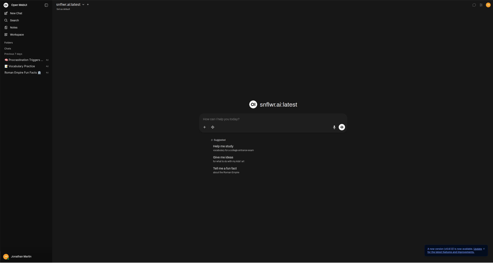
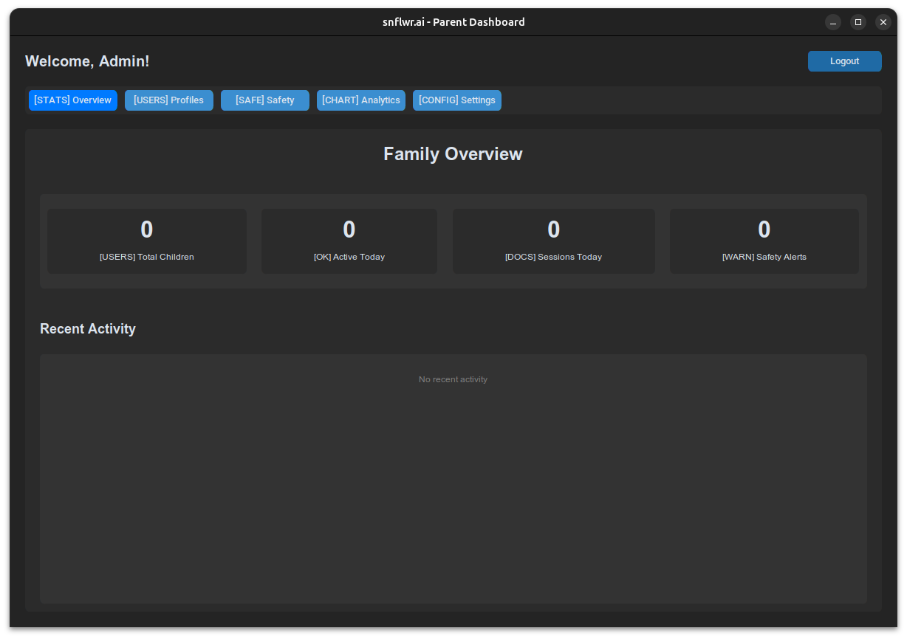
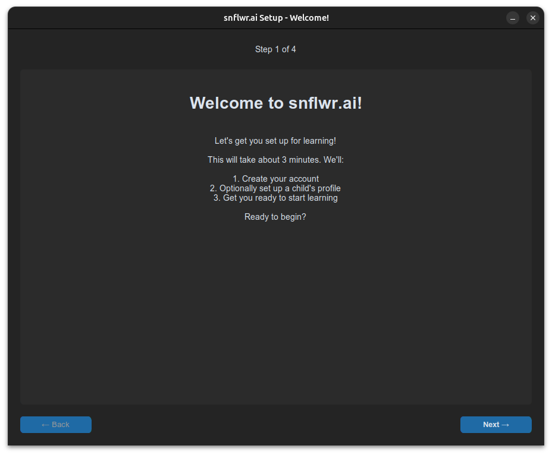
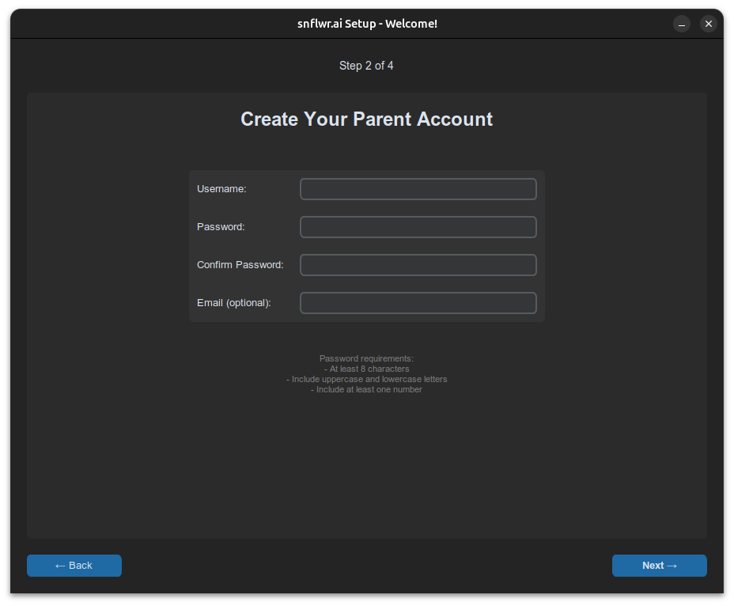
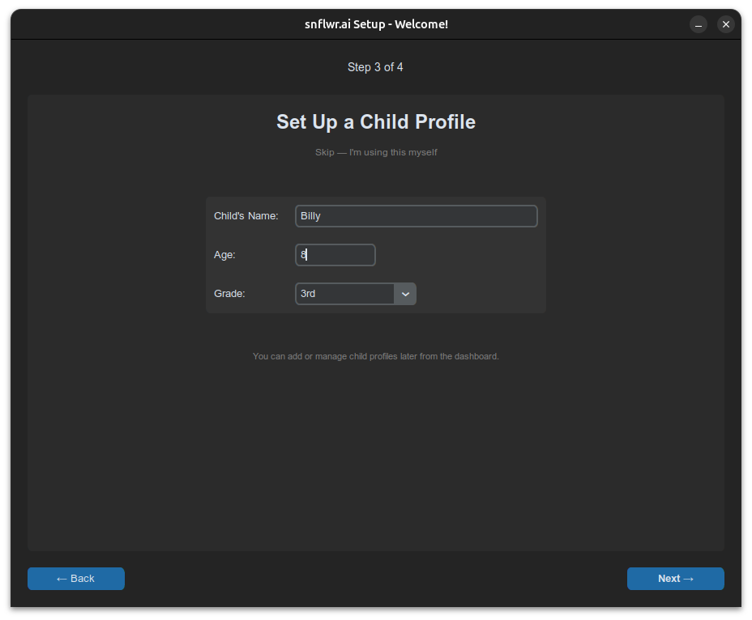

<p align="center">
  
</p>

<h1 align="center">snflwr.ai</h1>

<p align="center">
  <strong>K-12 Safe AI Learning Platform</strong><br>
  Your child talks to AI. You control what it says back.
</p>

<p align="center">
  <a href="#-quick-start">Quick Start</a>&nbsp;&bull;
  <a href="#-why-snflwrai">Why snflwr.ai</a>&nbsp;&bull;
  <a href="#-screenshots">Screenshots</a>&nbsp;&bull;
  <a href="#-deployment">Deployment</a>&nbsp;&bull;
  <a href="https://snflwr-ai.github.io/snflwr.ai/">Documentation</a>
</p>

<p align="center">
  <!-- Live status -->
  <a href="https://github.com/snflwr-ai/snflwr.ai/actions/workflows/ci.yml"></a>
  <a href="https://github.com/snflwr-ai/snflwr.ai/actions/workflows/security-scan.yml"></a>
  <a href="https://github.com/snflwr-ai/snflwr.ai/releases/latest"></a>
  
</p>
<p align="center">
  <!-- Static -->
  
  
  
  
  
</p>

<br>

> **snflwr.ai** wraps [Open WebUI](https://github.com/open-webui/open-webui) with a FastAPI backend that enforces multi-layer content filtering, parental oversight, and encrypted data storage. Every message passes through a 5-stage safety pipeline that **cannot be bypassed from the frontend**. It runs entirely on your hardware — no cloud accounts, no data leaving your network.

<br>

## Why snflwr.ai?

<table>
<tr>
<td width="33%" align="center">

**Runs Offline**

No cloud, no accounts, no data
leaving your network. Deploy on a
USB drive for complete physical
data control.

</td>
<td width="33%" align="center">

**Fail-Closed Safety**

5-stage content pipeline: input
validation, normalization, pattern
matching, LLM classification, and
age-adaptive rules. If any stage
errors, content is **blocked**.

</td>
<td width="33%" align="center">

**Parent Dashboard**

Real-time monitoring of every
conversation. Safety incident
alerts, usage analytics, and
full chat history review.

</td>
</tr>
<tr>
<td align="center">

**K-5 through 12th Grade**

Age-adaptive filtering per child
profile. Content rules tighten for
younger students and relax
appropriately for older ones.

</td>
<td align="center">

**Enterprise Ready**

PostgreSQL, Redis, Celery,
Prometheus/Grafana, horizontal
scaling, and COPPA/FERPA audit
trails for school districts.

</td>
<td align="center">

**Encrypted Everything**

AES-256 at rest (SQLCipher),
TLS 1.3 in transit, Argon2id
password hashing. PII is never
stored in plaintext.

</td>
</tr>
</table>

<br>

## How It Works

```
Student                                                              Student
  │                                                                    ▲
  ▼                                                                    │
Open WebUI ──► FastAPI Backend ──► Safety Pipeline ──► Ollama ──► Response
                                     │                            Filtered
                                     ├─ 1. Input validation
                                     ├─ 2. Unicode normalization
                                     ├─ 3. Pattern matching
                                     ├─ 4. LLM classification (optional)
                                     └─ 5. Age-adaptive rules
```

All AI inference runs locally via [Ollama](https://ollama.com). The safety pipeline sits between the user and the model — there is no path around it.

<br>

## Screenshots

<table>
<tr>
<td width="33%" align="center">



**Chat Interface**<br>
<sub>Students interact with a polished AI tutor</sub>

</td>
<td width="33%" align="center">



**Parent Dashboard**<br>
<sub>Monitor conversations and safety incidents</sub>

</td>
<td width="33%" align="center">



**Setup Wizard**<br>
<sub>Interactive installer detects your hardware</sub>

</td>
</tr>
<tr>
<td width="33%" align="center">



**Create Parent Account**<br>
<sub>Set up your parent credentials</sub>

</td>
<td width="33%" align="center">



**Set Up Child Profile**<br>
<sub>Configure age-adaptive filtering per child</sub>

</td>
<td width="33%" align="center">
</td>
</tr>
</table>

<br>

## Quick Start

**Prerequisites:** 8 GB RAM recommended (4 GB minimum) &middot; 10 GB free disk &middot; Docker Desktop

```bash
# Linux / macOS
chmod +x setup.sh start_snflwr.sh
./setup.sh

# Windows
.\setup.bat
```

The installer creates a virtual environment, installs dependencies, sets up Docker and Ollama, pulls an AI model sized to your hardware, generates credentials, and writes `.env`. Then start:

```bash
./start_snflwr.sh          # Linux / macOS
START_SNFLWR.bat            # Windows (double-click)
```

Open **http://localhost:3000** — the startup script launches everything and opens your browser.

<details>
<summary><strong>Already have Python and Ollama?</strong></summary>

Run `python install.py` directly, then `./start_snflwr.sh`.

</details>

<details>
<summary><strong>USB drive?</strong></summary>

Double-click `Start Snflwr` in the USB root. Platform-specific launchers (`.bat`, `.desktop`, `.command`) detect your OS automatically.

</details>

<details>
<summary><strong>PowerShell script execution disabled?</strong></summary>

Run once: `Set-ExecutionPolicy -ExecutionPolicy RemoteSigned -Scope CurrentUser`
Or use `START_SNFLWR.bat` instead.

</details>

<br>

## Deployment

| Scenario | Command | What you get |
|----------|---------|--------------|
| **Family / USB** | `./setup.sh && ./start_snflwr.sh` | SQLite, AES-256 encryption, fully offline, no Docker needed |
| **Home Server** | `./deploy.sh` | Docker, auto GPU detection, persistent services |
| **School / Enterprise** | `enterprise/build.sh` | PostgreSQL, Redis, Celery, Prometheus, Grafana, COPPA/FERPA audit |

<details>
<summary><strong>Home Server details</strong></summary>

```bash
./deploy.sh                          # handles secrets, GPU, images, model, browser
./deploy.sh --stop                   # stop all services
./deploy.sh --update                 # pull latest updates
./deploy.sh --logs                   # tail logs
./deploy.sh --model gemma4:12b      # use a smaller model
```

</details>

<details>
<summary><strong>Enterprise details</strong></summary>

```bash
enterprise/build.sh
docker compose -f docker/compose/docker-compose.yml up -d
```

See **[enterprise/README.md](enterprise/README.md)** for the full guide.

</details>

<br>

## Configuration

The installer generates a `.env` with all required settings. Key variables:

```bash
DB_TYPE=sqlite                         # or: postgresql
OLLAMA_DEFAULT_MODEL=snflwr.ai-31b     # the certified tutor; written by deploy.sh
DB_ENCRYPTION_ENABLED=true
JWT_SECRET_KEY=<auto-generated>
DB_ENCRYPTION_KEY=<auto-generated>
```

### AI Models

The user-facing chat model is always **`snflwr.ai`** — what kids see in the
Open WebUI dropdown. It is built locally by the install / deploy scripts as a
base model whose size the installer chooses from your hardware. `deploy.sh`
auto-selects by **system RAM** and tops out at **`gemma4:e4b`** (it won the June
2026 tutoring bake-off); systems below ~14 GB RAM / ~6 GB VRAM are unsupported
and the install refuses rather than downgrading. Kids
never see the raw base-model tag.

**Backbone capability is a function of your hardware, not of "home vs
enterprise."** Any box with enough VRAM — a high-end home rig or an enterprise
node — can opt up to the larger `gemma4:31b` backbone; a modest box of either
kind stays on e4b. The one floor that matters is **VRAM co-resident with the
~5 GB `llama-guard3:8b` safety classifier** (always loaded alongside the tutor —
that's why each row's VRAM floor exceeds the model's own size):

| What | Model | Weights | Requirement | Notes |
|---|---|---|---|---|
| **Tutor** | **`snflwr.ai-31b`** (built on `gemma4:31b`) | ~19 GB | **~22 GB VRAM** | The only backbone with a sealed tutoring run. A box that cannot hold it does not tutor — the serving plan refuses rather than serve an unmeasured model. |
| Safety classifier | `llama-guard3-cpu` | ~5 GB | RAM, not VRAM | **CPU-pinned on purpose.** On the card it was evicted mid-request and failed closed, blocking children on harmless questions. Same blob digest as the GPU build; 1.9 s vs 1.8 s. |
| Homework gate / reveal confirm | `gemma4:e4b` (base weights) | ~10 GB | RAM | Pinned away from the tutor model deliberately: run on the tutor, the confirm inherited its persona, emitted two characters and scored **0% recall** on 20 known reveals. |

**There is one tutor, not a ladder (2026-09-20).** The smaller backbones were
retired from tutoring on measured quality: `gemma4:31b` scored **88.8 against
e4b's 80.3** overall, and on the same 121 probes cut wrong content **17 → 4**,
canned fallback 27 → 5 and refusals 31 → 10. Throughput is the real cost — 31b
serves roughly a quarter of the students per card — and that is not a reason to
teach children wrong content.

Ask what a given box can serve:

```bash
python3 scripts/certified_tutor.py          # model, base and context window, or exit 3
```

> **Retired claim.** This table used to gate 31b at **≥26 GB** "because it cannot
> co-reside with the 5 GB guard". That premise is gone: the guard is CPU-pinned,
> and a 23 GB card serves the 31b tutor in production today.

The wrapper bundles the K-12 tutor system prompt (all school subjects — STEM
plus reading, writing, history, civics, and the arts), sampling parameters
(including `repeat_penalty` to prevent reasoning loops), and safety stop
sequences from [`models/Snflwr_AI_Kids.modelfile`](models/Snflwr_AI_Kids.modelfile).

To switch the underlying base, re-run `./deploy.sh --model gemma4:e4b`
(or set `BASE_MODEL` in `.env.home` and re-run `./deploy.sh`). The
`snflwr.ai` wrapper will be rebuilt automatically on top of the new base.

**Streaming (optional):** set `CHAT_STREAMING_ENABLED=true` for hold-back
streaming — the tutor's reply is streamed once the safety pipeline has vetted it,
so the first vetted text appears in ~1–2 s instead of after the full response,
without weakening output checking.

<br>

## Security & Compliance

> **Compliance status:** the items below are COPPA/FERPA-**supporting
> engineering**, not legal certification. The legal documents in [`legal/`](legal/)
> are **DRAFT** and no business entity is registered yet, so snflwr.ai is not yet
> legally launchable as a paid service. See **[docs/CURRENT_STATUS.md](docs/CURRENT_STATUS.md)**.

| Layer | Implementation |
|-------|---------------|
| **Encryption at rest** | AES-256 via SQLCipher |
| **Encryption in transit** | TLS 1.3 |
| **Password hashing** | Argon2id (PBKDF2 fallback) |
| **Authentication** | JWT with secure session management |
| **Privacy** | All data local — never sent to external APIs |
| **COPPA** | Parental consent flow, data minimization, automated retention cleanup |
| **FERPA** | Student record protections, parent/guardian access controls |
| **GDPR** | Data deletion and export endpoints |

See [SECURITY.md](SECURITY.md) for the vulnerability disclosure policy.

<br>

## Testing

```bash
pytest tests/ -v -m "not integration"
```

**3,500+ tests** across 100+ test files at **88% coverage** — authentication, profiles, safety pipeline, encryption, database, API routes, middleware, WebSockets, caching, and model management.

<br>

## Monitoring

Enterprise deployments include Grafana dashboards, Prometheus alerting, and Sentry error tracking with COPPA-compliant PII filtering. See [MONITORING_GUIDE.md](docs/deployment/MONITORING_GUIDE.md).

<br>

## Documentation

| Topic | Links |
|-------|-------|
| Getting Started | [Setup](docs/guides/SETUP.md) &middot; [Quickstart](docs/guides/QUICKSTART.md) |
| Administration | [Admin Guide](docs/guides/ADMIN_SETUP_GUIDE.md) |
| Security | [Database Encryption](docs/guides/DATABASE_ENCRYPTION.md) &middot; [Compliance](docs/compliance/SECURITY_COMPLIANCE.md) |
| Safety | [Request Flow & Safety](docs/architecture/REQUEST_FLOW_AND_SAFETY.md) &middot; [Grade Filtering](docs/safety/GRADE_BASED_FILTERING.md) |
| Compliance | [COPPA Consent](docs/compliance/COPPA_CONSENT_MECHANISM.md) &middot; [Age Policy](docs/compliance/AGE_16_POLICY.md) |
| Deployment | [Production](docs/deployment/PRODUCTION_DEPLOYMENT_GUIDE.md) &middot; [USB](docs/deployment/USB_DEPLOYMENT_GUIDE.md) |
| Architecture | [Overview](docs/architecture/ARCHITECTURE.md) &middot; [API Examples](docs/architecture/API_EXAMPLES.md) |
| Troubleshooting | [Guide](docs/guides/TROUBLESHOOTING_GUIDE.md) |

<br>

## Contributing

We welcome contributions in safety filter accuracy, multi-language support, edge case testing, documentation, and UI/UX. Please read [CONTRIBUTING.md](CONTRIBUTING.md) and [CODE_OF_CONDUCT.md](CODE_OF_CONDUCT.md) before opening a PR.

<br>

## Support

- [GitHub Issues](https://github.com/snflwr-ai/snflwr.ai/issues) — Bug reports and feature requests
- [GitHub Discussions](https://github.com/snflwr-ai/snflwr.ai/discussions) — Questions and community help
- [Discord](https://discord.gg/5rJgQTnV4s) — Open WebUI community chat

<br>

## License

Proprietary — see [LICENSE](LICENSE). All rights reserved; no use, copying, modification or distribution except under a written agreement with snflwr.ai.

Versions published between 2026-02-27 and 2026-09-18 were released under AGPL-3.0, and copies obtained in that window remain governed by AGPL-3.0.

The Open WebUI frontend has its own license: [frontend/open-webui/LICENSE](frontend/open-webui/LICENSE).

Commercial licensing: licensing@snflwr.ai

<br>

## Acknowledgments

- [Open WebUI](https://github.com/open-webui/open-webui) — Open-source AI interface
- [Ollama](https://ollama.com) — Local LLM inference
- [Google DeepMind](https://deepmind.google/) — Gemma model family (gemma4:e4b, the default tutor backbone)
- [Meta](https://ai.meta.com/) — Llama Guard safety classifier
- K-12 educators who provided feedback and testing

---

<p align="center">
  <strong>Built for educators, students, and families who value safety, privacy, and local AI.</strong><br>
  <sub><a href="https://snflwr-ai.github.io/snflwr.ai/">Documentation</a>&nbsp;&bull;&nbsp;<a href="https://github.com/snflwr-ai/snflwr.ai/discussions">Discussions</a>&nbsp;&bull;&nbsp;<a href="https://discord.gg/5rJgQTnV4s">Discord</a></sub>
</p>
